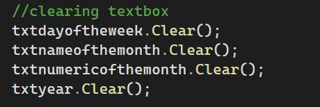

2. Creating Variables to Store User Input
Explanation
This code demonstrates how to declare string variables and assign values retrieved from TextBox controls in a C# Windows Forms application.
The string data type is used to store textual information, such as a first name, second name, and third name.
The Text property retrieves the information entered by the user in each TextBox and assigns it to the corresponding variable.
How It Works
1. Variable Declaration
Four string variables are declared to store personal information:
firstname – Stores the user's first name.
secondname – Stores the user's second name.
thirdname – Stores the user's third name.
fullname – Declared to represent the complete name.
2. Retrieving User Input
The Text property retrieves the values entered in the TextBox controls.
3. Assigning Values
Each retrieved value is assigned to its corresponding string variable.
Important Concepts
String Data Type: Stores text and character-based information.
Variable Declaration: Creates variables to store data.
Text Property: Retrieves the text entered by the user.
Assignment Operator (=): Assigns a value to a variable.
User Input: Information entered by the user through the application interface.
Practical Application
This technique is useful in applications that collect personal information, such as registration forms, student information systems, and user profile forms.
It allows the application to retrieve and temporarily store user input for further processing.
Key Takeaway
Declaring string variables and retrieving values through the Text property is an essential technique in C# Windows Forms programming. It enables developers to collect and manage user input efficiently.
Note: The fullname variable is declared in the provided code, but its value is not assigned in this example.

1. Clearing TextBoxes Using the Clear() Method
Explanation
This code demonstrates how to clear the contents of multiple TextBox controls in a C# Windows Forms application using the Clear() method.
The Clear() method removes all text from a TextBox, making it empty and ready for new user input.
How It Works
txtdayoftheweek.Clear() clears the day-of-the-week TextBox.
txtnameofmonth.Clear() removes the entered month name.
txtnumericofmonth.Clear() clears the numeric month value.
txtyear.Clear() removes the entered year.
Important Concepts
Clear() Method: Removes all text from a TextBox control.
TextBox Control: Allows users to enter and display text.
User Input Management: Helps reset form fields after processing information.
Practical Application
This method is useful when creating Reset or Clear buttons in Windows Forms applications. It allows users to erase previously entered information and start entering new data without manually deleting each value.
Key Takeaway
The Clear() method provides a simple and efficient way to reset multiple TextBox controls and prepare a form for new user input.