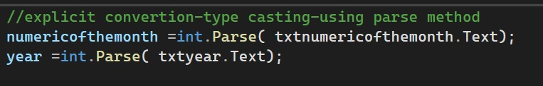
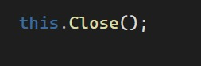

# Explanation
txtnumericOfTheMonth.Text
Gets the value entered by the user in the TextBox. The value is initially stored as a string.
int.Parse()
Converts the string value into an integer (int) so it can be used for mathematical or numerical operations.
numericOfTheMonth
Stores the converted month number as an integer.
txtyear.Text
Gets the year entered by the user as a string.
year
Stores the converted year as an integer.
Example
If the user enters:
Month: 9
Year: 2026
The program converts:
"9" → 9
"2026" → 2026
In short: int.Parse() is used to convert text entered in a TextBox from String → Integer.



# this.Close();

## Code Explanation

The `this.Close();` statement is used in C# Windows Forms to close the current form or window.

### Explanation of the Code

- **`this`** – Refers to the current form or object.
- **`.`** – The member access operator used to access a method.
- **`Close()`** – A method that closes the current form.
- **`;`** – Indicates the end of the C# statement.

### What Does It Do?

When `this.Close();` is executed, the current Windows Form is closed.

For example, it is commonly used with an **Exit button**:

```csharp
private void btnExit_Click(object sender, EventArgs e)
{
    this.Close();
}